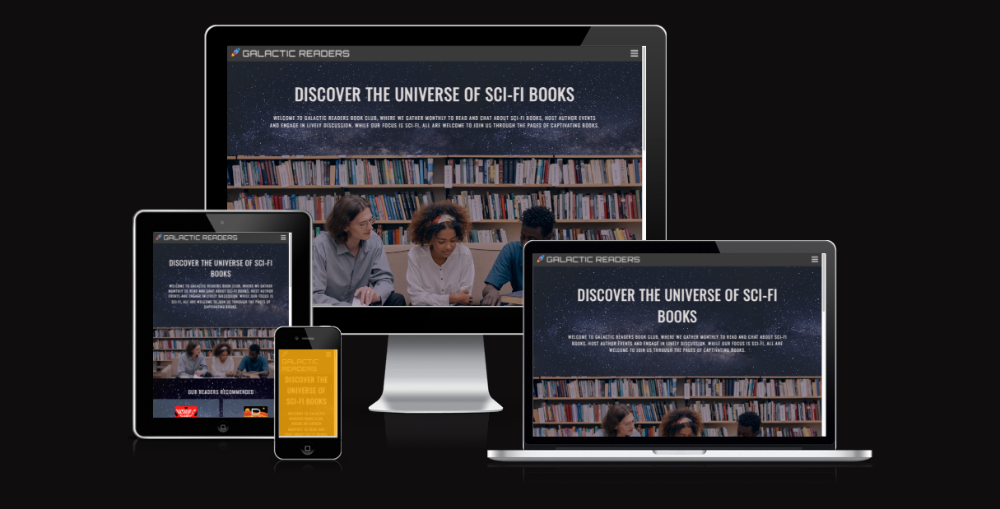
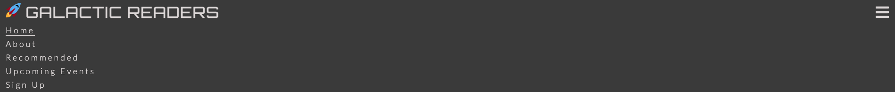
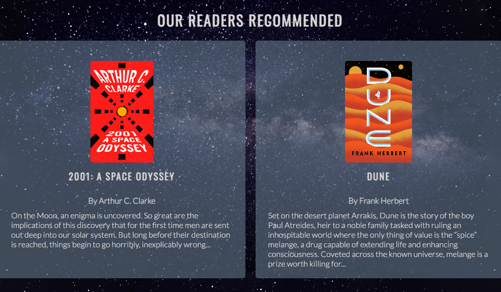
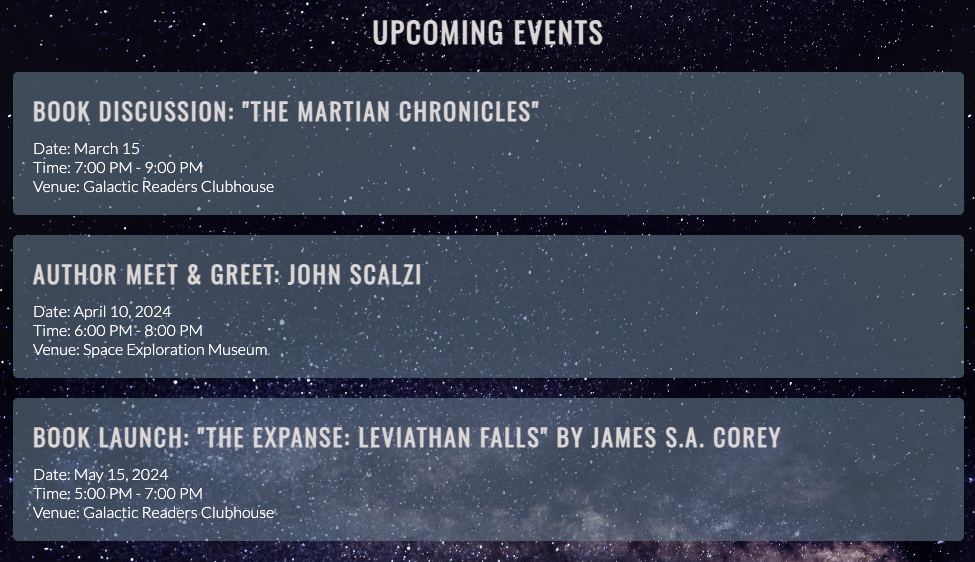
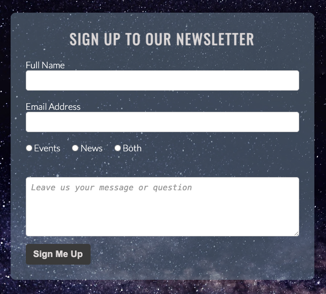
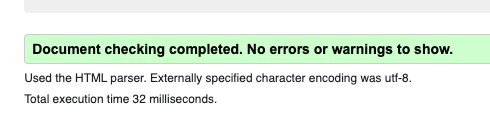
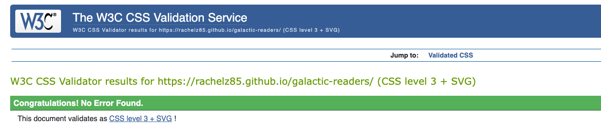

# Galactic Readers Sci-Fi Book Club

 Welcome to the Galactic Readers Book Club, an online platform designed for science fiction enthusiasts based in London, England. Our project aims to create a vibrant community where individuals passionate about science fiction literature can come together to explore the depths of the universe through captivating books.

The Galactic Readers Book Club is tailored for avid readers seeking an interactive and engaging to discuss their favorite science fiction novels, attend author events, and participate in lively discussions. Whether you're a seasoned sci-fi aficionado or just dipping your toes into the genre, our platform offers something for everyone.

Join us as we embark on a journey through the cosmos, unraveling the mysteries of distant galaxies, encountering alien civilizations, and delving into the depths of futuristic technologies. Whether you're interested in classics like "2001: A Space Odyssey" by Arthur C. Clarke or newer releases like "Project Hail Mary" by Andy Weir, there's a place for you at the Galactic Readers Book Club.

With a user-friendly interface and a diverse range of features, our platform strives to foster a sense of community among science fiction readers, providing a space where ideas can be shared, friendships can be formed, and imaginations can soar. Whether you're looking for your next great read or eager to connect with fellow enthusiasts, the Galactic Readers Book Club is here to enrich your sci-fi experience. Join us and embark on an unforgettable literary voyage through the cosmos!

[Live Website](https://rachelz85.github.io/galactic-readers/)

## Features

### Navigation Bar:
The navigation bar is prominently displayed across all pages, offering users easy access to key sections such as Home, About, Recommended Books, Upcoming Events, and Sign Up to our Newsletter. It facilitates smooth navigation, ensuring users can seamlessly explore the Galactic Readers Book Club's offerings, catering to both seasoned sci-fi enthusiasts and newcomers alike. This feature streamlines user interaction, enhancing accessibility and engagement with the website's content.

### About Us Section:
The About Us section provides a concise overview of the Galactic Readers Book Club, inviting users to discover the universe of science fiction literature. It serves as a welcoming introduction to the platform, appealing to individuals interested in joining a community of like-minded readers. By highlighting the club's mission and offerings, this section aims to attract potential members and foster a sense of belonging within the sci-fi literary community.

### Recommended Books Section:
Featuring a curated selection of recommended sci-fi books, this section offers valuable insights into must-read titles within the genre. Whether users are searching for classic masterpieces or contemporary bestsellers, this feature provides a diverse range of literary recommendations to satisfy every reader's preferences. By showcasing compelling book summaries and author details, the Recommended Books section aims to inspire exploration and ignite enthusiasm for science fiction literature among users.

### Upcoming Events Section:
The Upcoming Events section keeps users informed about upcoming book discussions, author meet-and-greets, and book launches hosted by the Galactic Readers Book Club. This feature appeals to individuals seeking opportunities to engage with fellow sci-fi enthusiasts and participate in enriching literary events. By providing event details and dates, this section encourages active participation and fosters a sense of community among users, enhancing their overall experience with the platform.

### Sign Up Form:
The Sign Up form allows users to subscribe to the Galactic Readers Book Club's newsletter, enabling them to stay updated on the latest news, events, and book recommendations. It caters to individuals interested in receiving regular updates and exclusive content from the club, serving as a gateway to deeper engagement with the sci-fi literary community. By offering a simple and convenient registration process, this feature encourages user involvement and strengthens the club's connections with its audience.

## Testing

### Validator Testing

- HTML: Passed validation without errors when tested with the official [W3C validator](https://validator.w3.org/nu/?doc=https%3A%2F%2Frachelz85.github.io%2Fgalactic-readers%2F)

- CSS: Passed validation without errors when tested with the official [W3C Jigsaw](https://jigsaw.w3.org/css-validator/validator?uri=https%3A%2F%2Frachelz85.github.io%2Fgalactic-readers%2F&profile=css3svg&usermedium=all&warning=1&vextwarning=&lang=en)

### Bugs and Issues
During testing, no significant bugs or issues were encountered that impeded the functionality or usability of the website. However, minor adjustments were made to optimize the layout and styling for improved user experience across different devices.

### Browser and Screen Size Compatibility
Tested the website on multiple browsers including Google Chrome, Mozilla Firefox, and Safari to ensure consistent performance and appearance.
Checked responsiveness on different screen sizes ranging from desktop monitors to mobile devices, ensuring that the website adapts seamlessly to varying screen resolutions.

## Deployment

### GitHub Pages

The website was deployed using GitHub Pages by following these steps:

1. **GitHub Repository Settings:** Navigate to the GitHub repository containing the project.

2. **Select Deployment Branch:** In the repository, navigate to the Settings tab.

3. **Choose Branch:** For the source select Branch: main

4. **Automatic Refresh:** Once the branch is selected, the page will automatically refresh

5. **Deployment Confirmation:** After the refresh, a detailed ribbon display will appear, indicating the successful deployment of the project.

6. **Live Link:** The live link to the deployed website will be generated automatically: "Your site is published at https://rachelz85.github.io/galactic-readers/"

## Credits and Resources

- Navbar rocket logo and favicon from [Favicon](https://favicon.io/)

- Fonts from https://fonts.google.com/

- The background image used throughout the website was taken from [Pexels](https://www.pexels.com/)

- Social Media Icons taken from [Font Aweseme](https://fontawesome.com/)